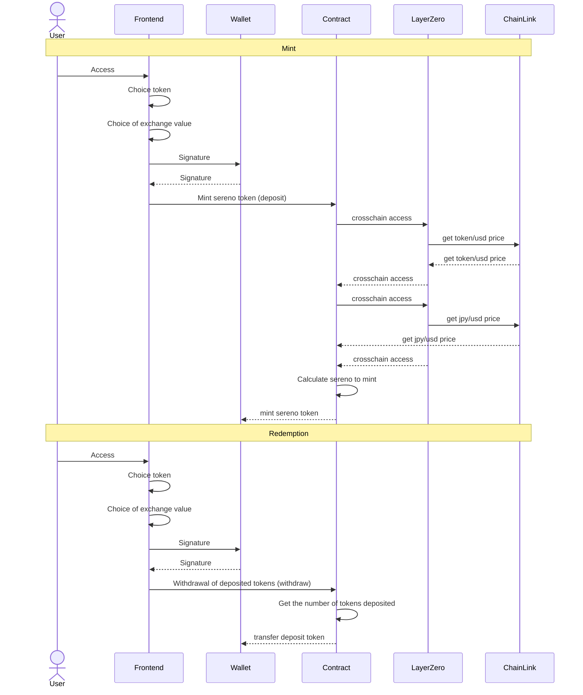

# Sequence flow

```mermaid
sequenceDiagram
    actor user as User
    participant front as Frontend
    participant wallet as Wallet
    participant contract as Contract
    participant layerzero as LayerZero
    participant chainlink as ChainLink

    Note over user,chainlink: Mint
    user ->> front: Access
    front ->> front: Choice token
    front ->> front: Choice of exchange value
    front ->> wallet: Signature
    wallet -->> front: Signature
    front ->> contract: Mint sereno token (deposit)

    contract ->> layerzero: crosschain access
    layerzero ->> chainlink: get token/usd price
    chainlink -->> layerzero: get token/usd price
    layerzero -->> contract: crosschain access

    contract ->> layerzero: crosschain access
    layerzero ->> chainlink: get jpy/usd price
    chainlink -->> contract: get jpy/usd price
    layerzero -->> contract: crosschain access

    contract ->> contract: Calculate sereno to mint
    contract -->> wallet: mint sereno token

    Note over user,chainlink: Redemption
    user ->> front: Access
    front ->> front: Choice token
    front ->> front: Choice of exchange value
    front ->> wallet: Signature
    wallet -->> front: Signature
    front ->> contract: Withdrawal of deposited tokens (withdraw)
    contract ->> contract: Get the number of tokens deposited
    contract -->> wallet: transfer deposit token
```
